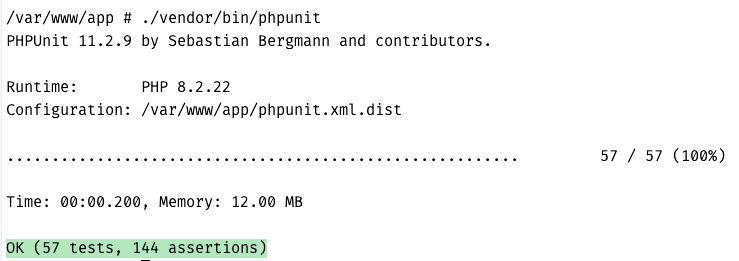

# Fruits and Vegetables Storage Service

The Fruits and Vegetables Storage Service is a simple application designed to manage and query collections of fruits and vegetables. 


## Business Requirements

* Automatically process and categorise data from a `request.json` file into two separate collections: Fruits and Vegetables.
* Store data in a database.
* Make sure the data is accurate and items are correctly categorised.
* Allow users to add new items, remove existing ones, and list all items in each collection.
* Store item weights in grams, with the option to convert and show weights in kilograms if needed.
* Improve usability by letting users choose their preferred unit of measurement.
* Create API endpoints for querying and filtering the collections to make data retrieval efficient.
* Provide extra settings for how units are displayed and how data is retrieved.
* Add a search endpoint to help users find specific items within the collections quickly.

## Functional Requirements

* The service must read and parse a `request.json` file.
* The service must store items from the JSON file into two separate database tables: `fruits` and `vegetables`.
* The service must allow users to add new items to either collection.
  * Each item must have a name and quantity in grams.
* The service must allow users to remove items from either collection.
* The service must provide a method to list all items in the `fruits` and `vegetables` collection, showing item names and quantities with an option to convert and display them in kilograms if requested.
* An API endpoint must be available for querying collections, with support for filters on type and name and the option to choose the unit of measurement like grams or kilograms.
* An API endpoint must be available for adding new items to the collections.
* An API endpoint must be available for removing new items to the collections.
* An API endpoint must be available to search method to find items within both collections based on criteria such as item name.

## Technologies Used

The project is built using the following technologies:

- [PHP 8.2](https://www.php.net/releases/8.2/en.php)
- [Symfony 7](https://symfony.com/7)
- [MySQL](https://www.mysql.com/)
- [Docker](https://www.docker.com/)
- [Docker Compose](https://docs.docker.com/compose/), [Alpine Docker Image](https://hub.docker.com/_/alpine)
- [Elasticsearch](https://www.elastic.co/elasticsearch)
- [Nginx](https://www.nginx.com)
- [Composer](https://getcomposer.org/)
- [PHPUnit](https://phpunit.de/)
- [Makefile](https://makefiletutorial.com/)


## Set Up Instructions

Before starting, ensure you have [Docker](https://www.docker.com/products/docker-desktop/) and `docker-compose` installed and running on your system.

### Set up the project:

1. Clone the repository to your local machine.
2. Navigate to the project's directory.
3. Build Docker containers:

   ```bash
   docker-compose build
   ```

4. Start Docker containers:

   ```bash
   docker-compose up -d
   ```

Once the project container is running, follow these steps inside the `php` container:

1. Access the `php` container:

   ```bash
   docker exec -it php /bin/sh
   ```

2. Install dependencies:

   ```bash
   composer install
   ```

3. Execute migration files:

   ```bash
   php bin/console doctrine:migrations:migrate
   ```

**Alternatively**, you can use `make` to quickly set up the project:

1. Ensure `make` is installed on your system.
2. Run the setup command:

   ```bash
   make run-setup
   ```


### Populate Data

Once the project setup is complete and the `php` container is ready, follow these steps to populate the database with data:

1. **Access the `php` Container:**

   Run the following command to open a shell inside the `php` container:

   ```bash
   docker exec -it php /bin/sh
   ```

2. **Run the Symfony Command:**

   Inside the `php` container, execute the custom Symfony command to read and parse data from `request.json`:

   ```bash
   php bin/console app:process-item-file request.json
   ```

**Alternatively,** Use the `make` Command:

   You can also import data using the following `make` command:

   ```bash
   make add-data
   ```


## Endpoints

Based on the functional requirements, the following API endpoints are available:

### List with Filter

`GET /api/storage` Retrieve a list of items based on a type, with the option to apply additional filters.

Examples:
- `GET /api/storage?type=fruit` List all fruits.
- `GET /api/storage?type=vegetable&unit=kg` List all vegetables with quantities in kilograms.
- `GET /api/storage?type=fruit&unit=kg&name=apple` List all fruits with the name "apple" and quantities in kilograms.

### Search

`GET /api/search?q=<text>` Search for items in both collections by their name using Elasticsearch.

### Add

`POST /api/storage` Add a new item to the collection.

Request Body:

```json
{
    "name": "Pepper",
    "type": "vegetable",
    "quantity": 1,
    "unit": "g"
}
```

### Remove

`DELETE /api/storage/<type>/<id>` Remove an item from the collection.

Examples:
- `DELETE /api/storage/fruit/123` Delete the fruit item with ID '123'.
- `DELETE /api/storage/vegetable/456` Delete the vegetable item with ID '456'.

Here's the [POSTMAN](https://www.postman.com/) collection for the API endpoints: [supermarket.postman_collection.json](postman-collection%2Fsupermarket.postman_collection.json)


## Running Tests

To validate functionality and ensure code quality, run the following command inside the `php` container (`docker exec -it php /bin/sh`):

```bash
./vendor/bin/phpunit
```

**Alternatively,** Use the `make` command:

```bash
make run-tests
```

This command will execute the test suite, running all defined tests to confirm that the application functions correctly and meets quality standards.

Screenshot:



## Contact

If you have any questions or feedback, 
please reach out to me: **Aparna Saha**
([LinkedIn](https://www.linkedin.com/in/aparnasaha/))

## License

This project is licensed under the MIT License (see [LICENSE](LICENSE.md) file).

